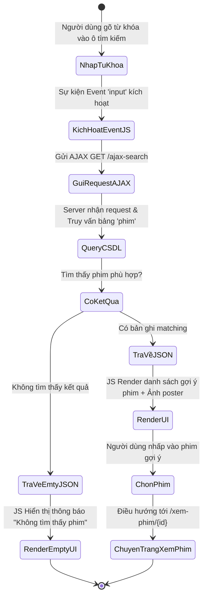
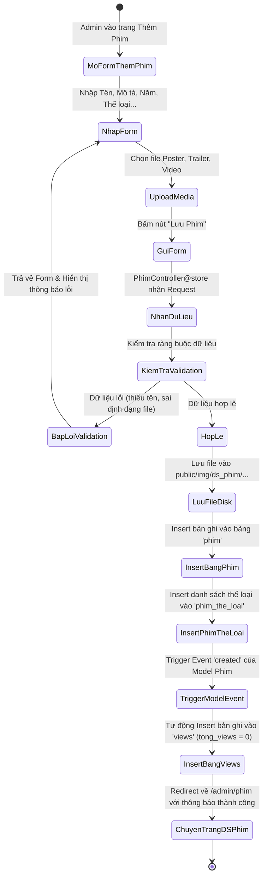
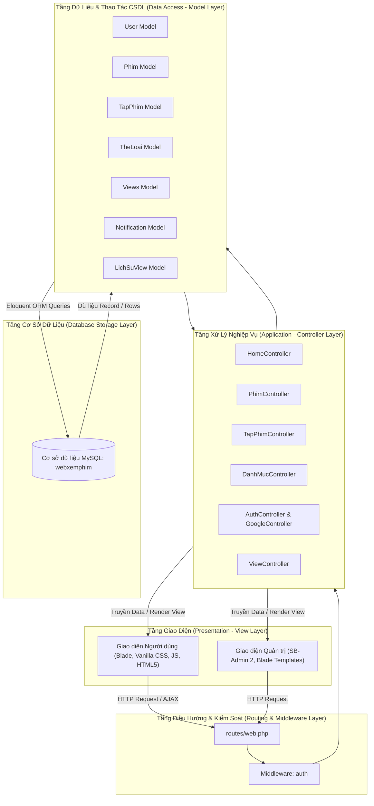
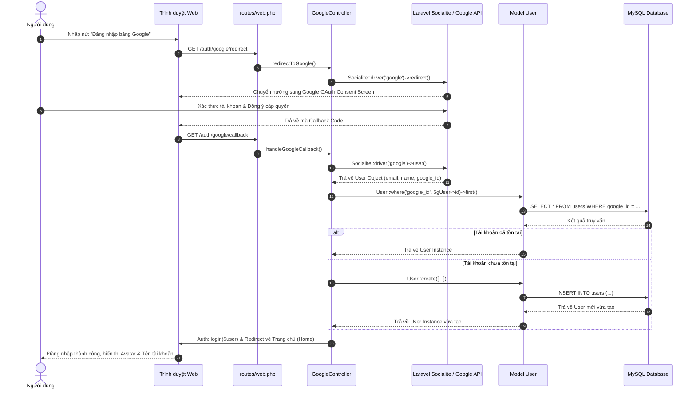
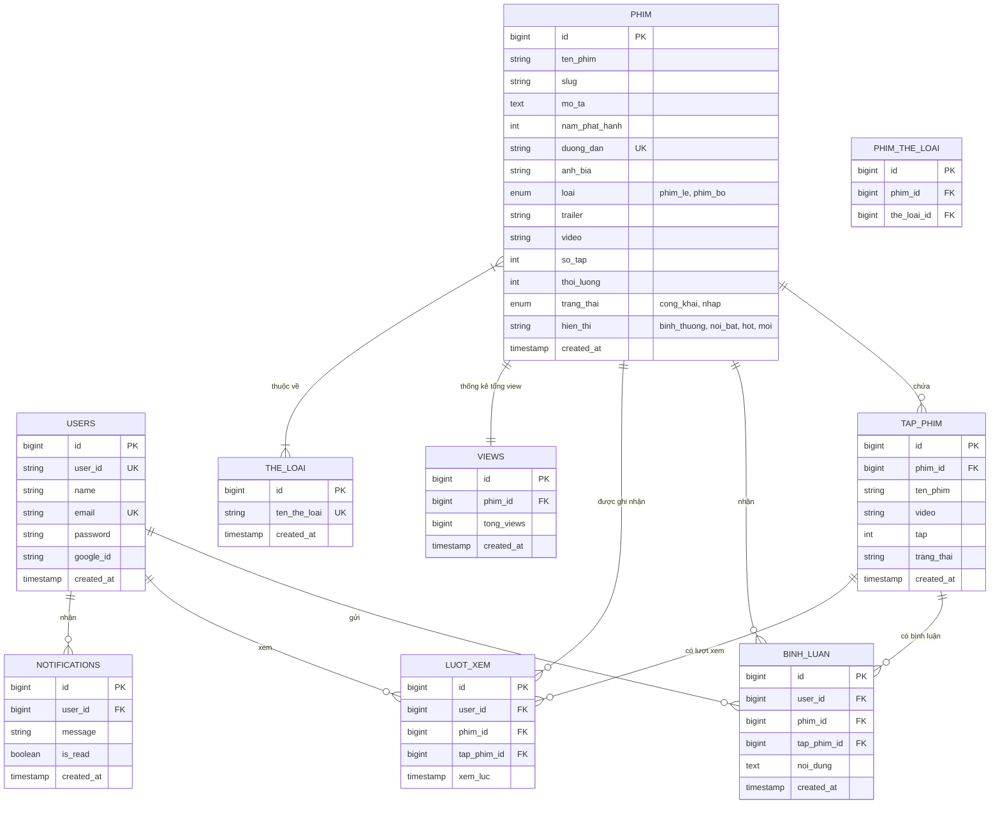
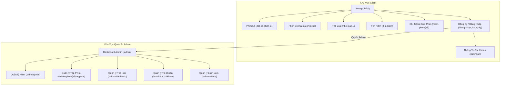

# CHƯƠNG 3: PHÂN TÍCH VÀ THIẾT KẾ HỆ THỐNG

---

## 3.1. GIỚI THIỆU CHUNG VỀ HỆ THỐNG

### 3.1.1. Bối cảnh và Lý do phát triển hệ thống
Trong kỷ nguyên số hiện nay, nhu cầu giải trí trực tuyến của con người ngày càng tăng cao, đặc biệt là lĩnh vực thưởng thức phim ảnh qua Internet. Các nền tảng xem phim truyền thống thường gặp hạn chế về tốc độ tải, giao diện phức tạp hoặc thiếu sự tương tác giữa người dùng và quản trị viên.

Hệ thống **Web Xem Phim Trực Tuyến** được nghiên cứu và phát triển trên nền tảng **Laravel 10 Framework (PHP 8.1+)** kết hợp cơ sở dữ liệu **MySQL** nhằm mang đến một giải pháp xem phim trực tuyến tốc độ cao, giao diện hiện đại (Dark Mode, Responsive), hỗ trợ tìm kiếm động AJAX và tích hợp phân hệ quản trị (Admin Dashboard) mạnh mẽ dựa trên template **SB-Admin 2**.

### 3.1.2. Mục tiêu phát triển hệ thống
1. **Xây dựng nền tảng xem phim đa phương tiện:** Hỗ trợ trình chiếu cả hai loại hình nội dung chính là Phim Lẻ (Single Movie) và Phim Bộ (Series Movie) với chất lượng cao, phát video mượt mà qua HTML5 Player.
2. **Tối ưu hóa trải nghiệm người dùng (UX):** Tích hợp tìm kiếm thông minh AJAX (AJAX Live Search), lọc phim theo thể loại, lưu vết lịch sử xem phim và tính năng bình luận thảo luận theo thời gian thực.
3. **Đa dạng hóa phương thức xác thực:** Hỗ trợ đăng ký/đăng nhập truyền thống và tích hợp đăng nhập an toàn 1-click qua tài khoản Google (OAuth 2.0 / Laravel Socialite).
4. **Chuẩn hóa công cụ quản trị (Admin Side):** Cung cấp giao diện quản trị trực quan cho phép Quản trị viên (Admin) quản lý toàn bộ vòng đời của dữ liệu: Phim, Tập phim, Danh mục/Thể loại, Tài khoản người dùng và Thống kê lượt xem.

### 3.1.3. Phạm vi và Phân quyền Hệ thống
Hệ thống được thiết kế phân quyền thành **3 Tác nhân (Actors)** chính:
* **Khách xem phim (Guest - Người dùng chưa đăng nhập):**
  * Duyệt danh sách phim mới, phim HOT, phim nổi bật, phim lẻ, phim bộ.
  * Tìm kiếm phim nhanh thông qua thanh tìm kiếm AJAX hoặc tìm kiếm nâng cao theo từ khóa.
  * Lọc danh sách phim theo từng thể loại (Hành động, Tình cảm, Hoạt hình, Phiêu lưu...).
  * Xem trailer phim và phát video xem phim trực tuyến.
  * Thực hiện đăng ký tài khoản mới hoặc đăng nhập bằng Email/Google.
* **Thành viên (Registered User/Member - Người dùng đã xác thực):**
  * Kế thừa toàn bộ quyền hạn của Khách xem phim.
  * Gửi bình luận, thảo luận bên dưới mỗi bộ phim hoặc tập phim cụ thể.
  * Xem danh sách thông báo hệ thống được gửi riêng cho tài khoản.
  * Quản lý thông tin tài khoản cá nhân.
  * Hệ thống tự động ghi nhận lịch sử xem phim (`luot_xem`).
* **Quản trị viên (Administrator):**
  * Truy cập khu vực quản trị bảo mật `/admin`.
  * Quản lý danh mục Thể loại (Thêm, sửa, xóa thể loại phim).
  * Quản lý Bộ Phim (Thêm mới phim lẻ/phim bộ, cập nhật thông tin, tải lên poster/trailer/video, gắn nhãn HOT/Nổi bật/Mới, ẩn/hiện phim).
  * Quản lý Tập Phim (Thêm, chỉnh sửa tập phim, gán link video tập phim đối với Phim bộ).
  * Quản lý Tài khoản (Xem danh sách tài khoản, kích hoạt hoặc khóa tài khoản người dùng).
  * Theo dõi và điều chỉnh thống kê lượt xem (`views`).

---

## 3.2. PHÂN TÍCH YÊU CẦU HỆ THỐNG

### 3.2.1. Yêu cầu Chức năng (Functional Requirements)

#### A. Phân hệ Khách hàng & Thành viên (Client Side)

```
                       ┌─────────────────────────────────────────┐
                       │  Phân hệ Khách hàng & Thành viên        │
                       └──────────────────┬──────────────────────┘
                                          │
    ┌──────────────────────┬──────────────┼──────────────┬──────────────────────┐
    │                      │              │              │                      │
┌───┴──────────────┐ ┌─────┴──────────┐ ┌─┴────────────┐ ┌┴───────────┐ ┌────────┴─────────┐
│ Xác thực & User  │ │ Tìm kiếm & Lọc │ │ Xem Phim     │ │ Bình luận   │ │ Thông báo       │
│ - Đăng ký/Đăng nhập│ │ - AJAX Search│ │ - Phim lẻ    │ │ - Gửi cmt   │ │ - Xem thông báo │
│ - Google OAuth2  │ │ - Lọc thể loại│ │ - Phim bộ    │ │ - Xem cmt   │ │ - Nhận tin nhắn │
│ - Thông tin TK   │ │ - Lọc loại phim│ │ - Thống kê   │ │             │ │                 │
└──────────────────┘ └────────────────┘ └──────────────┘ └─────────────┘ └─────────────────┘
```

1. **Quản lý Xác thực & Tài khoản:**
   * **Đăng ký tài khoản (`/dang-ky`):** Nhập Tên, Email, Mật khẩu. Hệ thống tự động sinh mã `user_id` ngẫu nhiên độc nhất (8 ký tự).
   * **Đăng nhập truyền thống (`/dang-nhap`):** Kiểm tra thông tin Email và Password (so sánh hash Bcrypt).
   * **Đăng nhập Google OAuth 2.0 (`/auth/google/redirect`):** Ủy quyền đăng nhập qua Google API. Nếu là người dùng mới, hệ thống tự động khởi tạo tài khoản với `google_id`.
   * **Đăng xuất (`/dang-xuat`):** Hủy Session xác thực an toàn.
   * **Trang thông tin tài khoản (`/taikhoan`):** Hiển thị thông tin hồ sơ người dùng cá nhân.

2. **Duyệt Phim & Tìm kiếm:**
   * **Trang chủ (`/`):** Hiển thị các khối dữ liệu: Carousel/Slider phim nổi bật, danh sách Phim HOT, Phim Mới Cập Nhật, Phim Lẻ, Phim Bộ.
   * **Danh sách Phim Lẻ (`/tat-ca-phim-le`):** Hiển thị bộ lọc và danh sách tất cả các bộ phim dạng phim lẻ.
   * **Danh sách Phim Bộ (`/tat-ca-phim-bo`):** Hiển thị danh sách các bộ phim nhiều tập.
   * **Lọc Phim theo Thể loại (`/the-loai/{slug}`):** Truy vấn và trả về danh sách phim thuộc thể loại tương ứng (Hành động, Tình cảm, Hoạt hình...).
   * **Tìm kiếm Động AJAX (`/ajax-search`):** Lắng nghe sự kiện gõ từ khóa trên ô Input Tìm kiếm, gửi request bất đồng bộ và trả về gợi ý danh sách phim cùng hình ảnh ngay lập tức.
   * **Trang Tìm kiếm Tĩnh (`/tim-kiem`):** Hiển thị kết quả tìm kiếm đầy đủ theo từ khóa.

3. **Xem Phim & Phát Video:**
   * **Trang Chi tiết Phim (`/xem-phim/{id}`):** Hiển thị đầy đủ thông tin: Poster, Tên phim, Tên gốc, Năm phát hành, Đạo diễn, Thời lượng, Số tập, Mô tả nội dung, Lượt xem tổng cộng (`tong_views`).
   * **Phát Trailer & Video Phim Lẻ:** Tích hợp trình chơi video HTML5 cho phép phát mượt mà trailer hoặc bản phim lẻ đầy đủ.
   * **Chọn Tập Phim (Phim Bộ):** Danh sách các tập phim (Tập 1, Tập 2, ...) được hiển thị dưới dạng nút bấm. Khi chuyển tập, trình xem phim cập nhật lại đường dẫn video tương ứng.
   * **Ghi nhận Lượt xem:** Tự động tăng số đếm trong bảng `views` và thêm bản ghi lịch sử vào bảng `luot_xem`.

4. **Tương tác & Thảo luận:**
   * **Bình luận Phim:** Cho phép thành viên đã đăng nhập nhập nội dung thảo luận bên dưới phim/tập phim. Hệ thống hiển thị bình luận kèm Tên người dùng và Thời gian gửi.
   * **Thông báo (`/notifications`):** Thành viên đăng nhập có thể xem danh sách các thông báo cá nhân hóa hệ thống gửi tới.

---

#### B. Phân hệ Quản trị viên (Admin Side)

1. **Dashboard Tổng quan (`/admin`):**
   * Hiển thị bảng điều khiển trung tâm với các thông số thống kê tổng quan hệ thống.
2. **Quản lý Thể loại / Danh mục (`/admin/danhmuc`):**
   * Hiển thị danh sách thể loại phim.
   * Thêm thể loại mới (tên thể loại unique).
   * Chỉnh sửa tên thể loại.
   * Xóa thể loại khỏi CSDL.
3. **Quản lý Bộ Phim (`/admin/phim`):**
   * Danh sách tất cả các bộ phim kèm công cụ lọc phim lẻ / phim bộ.
   * Thêm phim mới (`/admin/phim/them-phim`): Nhập tên phim, slug, mô tả, năm phát hành, loại phim (`phim_le` / `phim_bo`), thời lượng, số tập dự kiến, trạng thái (`cong_khai` / `nhap`), nhãn hiển thị (`binh_thuong`, `noi_bat`, `hot`, `moi`), tải lên file poster (`anh_bia`), trailer, video chính và chọn danh sách các thể loại liên kết.
   * Chỉnh sửa bộ phim (`/admin/phim/{id}/chinh-sua`): Cập nhật lại các trường thông tin hoặc thay đổi file media.
   * Xóa bộ phim (`DELETE /admin/phim/{id}`): Xóa bộ phim và tự động xóa các tập phim, bình luận, lượt xem liên quan (Cascade Delete).
4. **Quản lý Tập Phim (`/admin/phim/{id}/tapphim`):**
   * Danh sách các tập phim của bộ phim bộ tương ứng.
   * Chỉnh sửa thông tin tập phim (`/admin/phim/{phim}/tapphim/{tapPhim}/chinh-sua`): Cập nhật số tập, đường dẫn video, trạng thái hiển thị.
5. **Quản lý Tài khoản Người dùng (`/admin/ds_taikhoan`):**
   * Xem danh sách tài khoản đã đăng ký trong hệ thống (Mã `user_id`, Tên, Email, Ngày tạo).
   * Chuyển đổi trạng thái tài khoản (`PUT /admin/taikhoan/toggle-status/{user_id}`): Khóa hoặc Mở khóa quyền truy cập của người dùng.
6. **Quản lý Lượt xem / Views (`/admin/views`):**
   * Quản lý thống kê tổng lượt xem của Phim Lẻ và Phim Bộ.
   * Cho phép Admin cập nhật thủ công chỉ số lượt view khi cần thiết.

---

### 3.2.2. Yêu cầu Phi chức năng (Non-Functional Requirements)

1. **Hiệu năng & Tốc độ Phản hồi (Performance):**
   * Thời gian tải trang chủ và trang chi tiết phim $< 1.5$ giây.
   * Phản hồi tìm kiếm AJAX từ Server $< 300$ ms.
   * Biên dịch và tối ưu hóa file tài nguyên CSS/JS tĩnh bằng **Vite Bundler**.
   * Quản lý lưu trữ file media (Ảnh poster, Video) cấu trúc rõ ràng theo đường dẫn `public/img/ds_phim/...`.
2. **Bảo mật Hệ thống (Security):**
   * **Bảo vệ Route (Authentication Middleware):** Áp dụng middleware `auth` ngăn chặn người dùng chưa đăng nhập truy cập các tuyến đường yêu cầu xác thực (`/taikhoan`, `/notifications`, `/admin/*`).
   * **Chống lỗ hổng Web phổ biến:**
     * **CSRF (Cross-Site Request Forgery):** Bắt buộc tích hợp `@csrf` token trong tất cả các Form HTML gửi request POST/PUT/DELETE.
     * **SQL Injection:** Sử dụng Eloquent ORM Binding của Laravel giúp triệt tiêu hoàn toàn các truy vấn SQL độc hại.
     * **XSS (Cross-Site Scripting):** Sử dụng cú pháp Blade `{{ }}` để mã hóa tự động các chuỗi đầu ra từ người dùng.
   * **Mã hóa Mật khẩu:** Mã hóa một chiều mật khẩu người dùng bằng thuật toán Bcrypt tiêu chuẩn an toàn cao.
3. **Giao diện & Trải nghiệm Người dùng (UI/UX Design):**
   * Giao diện Client sử dụng tông màu tối (Dark Theme) tạo cảm giác sang trọng, cuốn hút, bảo vệ mắt người xem phim.
   * Thiết kế Responsive linh hoạt tương thích trên nhiều màn hình thiết bị (Máy tính bàn, Laptop, Tablet, Điện thoại di động).
   * Giao diện Admin tuân thủ chuẩn SB-Admin 2 với Menu Sidebar điều hướng khoa học, bảng dữ liệu linh hoạt.
4. **Tính Tiến hóa & Bảo trì (Maintainability & Scalability):**
   * Tổ chức mã nguồn chuẩn hóa theo mô hình kiến trúc MVC.
   * Cơ sở dữ liệu thiết kế chuẩn hóa 3NF, dễ dàng tích hợp các tính năng phát triển trong tương lai như: Thanh toán gói xem phim VIP, Đánh giá phim 5 sao, Tải phim offline...

---

## 3.3. PHÂN TÍCH VÀ THIẾT KẾ UML

### 3.3.1. Sơ đồ Use Case Tổng quan Hệ thống

Sơ đồ Use Case thể hiện sự tương tác giữa 3 Tác nhân chính (**Khách**, **Thành viên**, **Quản trị viên**) với các phân hệ chức năng của ứng dụng:

```mermaid
graph TD
    subgraph Actors ["Các Tác Nhân (Actors)"]
        Guest["👤 Khách xem phim"]
        Member["👨‍💻 Thành viên"]
        Admin["🔑 Quản trị viên (Admin)"]
    end

    subgraph UserModule ["Phân hệ Người dùng (Client)"]
        UC1["UC01: Đăng ký / Đăng nhập (Email & Google)"]
        UC2["UC02: Duyệt Phim & Lọc Thể loại"]
        UC3["UC03: Tìm kiếm Phim (AJAX Search)"]
        UC4["UC04: Xem Phim & Chọn Tập"]
        UC5["UC05: Bình luận Phim"]
        UC6["UC06: Xem Thông báo"]
        UC7["UC07: Quản lý Thông tin Cá nhân"]
    end

    subgraph AdminModule ["Phân hệ Quản trị (Admin)"]
        UC8["UC08: Đăng nhập Dashboard Admin"]
        UC9["UC09: Quản lý Bộ Phim (CRUD)"]
        UC10["UC10: Quản lý Tập Phim"]
        UC11["UC11: Quản lý Thể loại / Danh mục"]
        UC12["UC12: Quản lý Tài khoản Người dùng"]
        UC13["UC13: Quản lý Thống kê Lượt xem"]
    end

    Guest --> UC1
    Guest --> UC2
    Guest --> UC3
    Guest --> UC4

    Member --> UC1
    Member --> UC2
    Member --> UC3
    Member --> UC4
    Member --> UC5
    Member --> UC6
    Member --> UC7

    Admin --> UC8
    Admin --> UC9
    Admin --> UC10
    Admin --> UC11
    Admin --> UC12
    Admin --> UC13
```



---

### 3.3.2. Mô tả Chi tiết Các Use Case Cốt Lõi

#### 1. Use Case UC01: Đăng ký & Đăng nhập Hệ thống
* **Tác nhân:** Khách xem phim / Thành viên.
* **Mục đích:** Cho phép người dùng tạo tài khoản mới hoặc đăng nhập vào hệ thống để sử dụng các tính năng tương tác.
* **Điều kiện tiên quyết:** Người dùng truy cập trang `/dang-nhap` hoặc `/dang-ky`.
* **Luồng sự kiện chính (Đăng nhập Email/Password):**
  1. Người dùng nhập Email và Mật khẩu vào Form đăng nhập.
  2. Người dùng nhấn nút "Đăng nhập".
  3. `AuthController@login` tiếp nhận request, kiểm tra thông tin đối chiếu với CSDL `users`.
  4. Nếu thông tin hợp lệ, hệ thống tạo Session đăng nhập và chuyển hướng người dùng về Trang chủ.
* **Luồng sự kiện thay thế (Google OAuth 2.0):**
  1. Người dùng nhấp vào biểu tượng "Đăng nhập bằng Google".
  2. Hệ thống chuyển hướng sang giao diện xác thực Google OAuth.
  3. Người dùng chấp nhận chia sẻ thông tin tài khoản Google.
  4. `GoogleController` xử lý mã phản hồi, kiểm tra `google_id` trong bảng `users`:
     * Nếu đã tồn tại: Đăng nhập trực tiếp.
     * Nếu chưa tồn tại: Tạo mới tài khoản với Tên, Email, Google ID và tự động đăng nhập.

#### 2. Use Case UC03: Tìm kiếm Phim Động (AJAX Search)
* **Tác nhân:** Khách xem phim / Thành viên.
* **Mục đích:** Tìm kiếm bộ phim theo từ khóa tên phim một cách nhanh chóng ngay trên giao diện mà không cần tải lại trang.
* **Luồng sự kiện chính:**
  1. Người dùng nhập từ khóa tìm kiếm trên thanh Header.
  2. Sự kiện JavaScript `input` được kích hoạt, gửi Yêu cầu bất đồng bộ (XHR Request) tới Route `/ajax-search`.
  3. `HomeController@ajaxSearch` nhận từ khóa, thực hiện truy vấn `Phim::where('ten_phim', 'LIKE', '%'.$keyword.'%')->get()`.
  4. Server trả về kết quả định dạng JSON.
  5. JavaScript nhận kết quả JSON và tự động render danh sách gợi ý phim bên dưới ô tìm kiếm.

#### 3. Use Case UC04: Xem Phim & Chọn Tập
* **Tác nhân:** Khách xem phim / Thành viên.
* **Mục đích:** Phát video xem phim trực tuyến và chọn tập phim bộ đối với phim nhiều tập.
* **Luồng sự kiện chính:**
  1. Người dùng nhấp chọn một bộ phim từ danh sách.
  2. `HomeController@phuongThucXemPhim` xử lý request.
  3. Hệ thống tăng tự động lượt xem bộ phim trong bảng `views` (`tong_views = tong_views + 1`).
  4. Kiểm tra loại phim:
     * **Phim Lẻ:** Nạp trình phát Video phát trực tiếp file mp4 trong cột `video`.
     * **Phim Bộ:** Truy vấn danh sách các tập phim trong bảng `tap_phim` theo `phim_id`, hiển thị giao diện danh sách nút bấm các tập.
  5. Nếu người dùng chọn tập phim khác, trình phát video đổi nguồn video tương ứng với tập đã chọn.

#### 4. Use Case UC09: Quản lý Bộ Phim (Dành cho Admin)
* **Tác nhân:** Quản trị viên (Admin).
* **Mục đích:** Thêm mới, chỉnh sửa thông tin hoặc xóa bộ phim khỏi CSDL.
* **Luồng sự kiện chính (Thêm phim mới):**
  1. Admin truy cập đường dẫn `/admin/phim/them-phim`.
  2. Admin điền đầy đủ các thông tin: Tên phim, Slug, Mô tả, Năm phát hành, Loại phim, Số tập, Thời lượng, Nhãn hiển thị, các Thể loại đính kèm.
  3. Admin tải lên file Poster (`anh_bia`), Trailer và Video phim.
  4. Admin nhấn "Lưu Phim".
  5. `PhimController@store` lưu file media vào thư mục `public/img/ds_phim/...`, thêm bản ghi mới vào bảng `phim` và gán thể loại vào bảng `phim_the_loai`.
  6. Sự kiện Eloquent Model `created` tự động kích hoạt chèn bản ghi khởi tạo tổng lượt view = 0 vào bảng `views`.

---

### 3.3.3. Sơ đồ Hoạt động (Activity Diagrams)

#### A. Sơ đồ Hoạt động: Tiến trình Tìm kiếm AJAX (Client)



#### B. Sơ đồ Hoạt động: Tiến trình Admin Thêm Phim Mới



---

## 3.4. THIẾT KẾ KIẾN TRÚC HỆ THỐNG

### 3.4.1. Kiến trúc 3 Lớp MVC (Model - View - Controller)

Dự án được xây dựng dựa trên mô hình kiến trúc MVC phân tách rõ ràng giữa giao diện, logic xử lý và dữ liệu:



---

### 3.4.2. Sơ đồ Tuần tự (Sequence Diagram) - Tiến trình Đăng nhập Google OAuth



---

## 3.5. THIẾT KẾ CƠ SỞ DỮ LIỆU (DATABASE DESIGN)

### 3.5.1. Sơ đồ Quan hệ Thực thể (ERD - Entity Relationship Diagram)

Sơ đồ ERD thể hiện mối quan hệ giữa 9 thực thể bảng dữ liệu chính trong CSDL `webxemphim`:



---

### 3.5.2. Đặc tả Chi tiết các Bảng trong CSDL

#### Bảng 1: `users` (Quản lý Tài khoản Người dùng)
* **Chức năng:** Lưu trữ thông tin tài khoản người dùng và thông tin ủy quyền Google OAuth.
* **Khóa chính:** `id` | **Khóa duy nhất:** `user_id`, `email`

| STT | Tên Trường | Kiểu Dữ Liệu | Khóa / Ràng Buộc | Mô Tả Ý Nghĩa |
| :-: | :--- | :--- | :--- | :--- |
| 1 | `id` | `bigint unsigned` | PK, Auto Increment | ID tự tăng của tài khoản |
| 2 | `user_id` | `varchar(8)` | UNIQUE, NOT NULL | Mã định danh 8 ký tự độc nhất |
| 3 | `name` | `varchar(255)` | NOT NULL | Họ và tên người dùng |
| 4 | `email` | `varchar(255)` | UNIQUE, NOT NULL | Địa chỉ Email dùng đăng nhập |
| 5 | `password` | `varchar(255)` | NOT NULL | Mật khẩu tài khoản (mã hóa Bcrypt) |
| 6 | `google_id` | `varchar(255)` | NULL | ID xác thực tài khoản Google |
| 7 | `email_verified_at`| `timestamp` | NULL | Thời điểm xác minh Email |
| 8 | `remember_token` | `varchar(100)` | NULL | Token duy trì phiên đăng nhập |
| 9 | `created_at` | `timestamp` | NULL | Thời gian khởi tạo tài khoản |
| 10 | `updated_at` | `timestamp` | NULL | Thời gian cập nhật gần nhất |

---

#### Bảng 2: `phim` (Quản lý Bộ Phim)
* **Chức năng:** Lưu trữ thông tin chi tiết của từng bộ phim (Phim lẻ và Phim bộ).
* **Khóa chính:** `id` | **Khóa duy nhất:** `duong_dan`

| STT | Tên Trường | Kiểu Dữ Liệu | Khóa / Ràng Buộc | Mô Tả Ý Nghĩa |
| :-: | :--- | :--- | :--- | :--- |
| 1 | `id` | `bigint unsigned` | PK, Auto Increment | ID tự tăng bộ phim |
| 2 | `ten_phim` | `varchar(255)` | NOT NULL | Tên bộ phim |
| 3 | `slug` | `varchar(255)` | NULL | Chuỗi đường dẫn thân thiện SEO |
| 4 | `mo_ta` | `text` | NULL | Tóm tắt kịch bản / Nội dung phim |
| 5 | `nam_phat_hanh` | `int` | NULL | Năm phát hành (VD: 2024) |
| 6 | `duong_dan` | `varchar(255)` | UNIQUE, NULL | Đường dẫn xem phim tĩnh |
| 7 | `anh_bia` | `varchar(255)` | NULL | Đường dẫn file ảnh Poster/Banner |
| 8 | `loai` | `enum('phim_le','phim_bo')`| NOT NULL | Phân loại phim: Phim lẻ hoặc Phim bộ |
| 9 | `trailer` | `varchar(255)` | NULL | Đường dẫn video trailer |
| 10 | `video` | `varchar(255)` | NULL | Đường dẫn video chính (dành cho Phim lẻ) |
| 11 | `so_tap` | `int` | NULL | Tổng số tập phim (dành cho Phim bộ) |
| 12 | `thoi_luong` | `int` | NULL | Thời lượng phim (phút) |
| 13 | `trang_thai` | `enum('cong_khai','nhap')`| Default: `'cong_khai'` | Trạng thái hiển thị |
| 14 | `hien_thi` | `varchar(255)` | Default: `'binh_thuong'`| Nhãn nổi bật (`binh_thuong`, `noi_bat`, `hot`, `moi`) |
| 15 | `created_at` | `timestamp` | NULL | Thời gian đăng phim |
| 16 | `updated_at` | `timestamp` | NULL | Thời gian cập nhật phim |

---

#### Bảng 3: `tap_phim` (Quản lý Tập Phim của Phim Bộ)
* **Chức năng:** Quản lý từng tập phim cụ thể thuộc về một Phim Bộ.
* **Khóa chính:** `id` | **Khóa ngoại:** `phim_id` $\rightarrow$ `phim(id)` (ON DELETE CASCADE)

| STT | Tên Trường | Kiểu Dữ Liệu | Khóa / Ràng Buộc | Mô Tả Ý Nghĩa |
| :-: | :--- | :--- | :--- | :--- |
| 1 | `id` | `bigint unsigned` | PK, Auto Increment | ID tự tăng tập phim |
| 2 | `phim_id` | `bigint unsigned` | FK, NOT NULL | ID bộ phim liên kết |
| 3 | `ten_phim` | `varchar(255)` | NOT NULL | Tên bộ phim sở hữu |
| 4 | `video` | `varchar(255)` | NULL | Đường dẫn file video của tập phim |
| 5 | `tap` | `int` | NULL | Số thứ tự tập phim (Tập 1, 2, 3...) |
| 6 | `trang_thai` | `varchar(255)` | NULL | Trạng thái công khai/nháp |
| 7 | `created_at` | `timestamp` | NULL | Thời gian tải lên tập phim |
| 8 | `updated_at` | `timestamp` | NULL | Thời gian cập nhật tập phim |

---

#### Bảng 4: `the_loai` (Quản lý Thể loại Phim)
* **Chức năng:** Danh mục các thể loại phim phục vụ cho việc phân loại và tìm kiếm.
* **Khóa chính:** `id` | **Khóa duy nhất:** `ten_the_loai`

| STT | Tên Trường | Kiểu Dữ Liệu | Khóa / Ràng Buộc | Mô Tả Ý Nghĩa |
| :-: | :--- | :--- | :--- | :--- |
| 1 | `id` | `bigint unsigned` | PK, Auto Increment | ID tự tăng thể loại |
| 2 | `ten_the_loai` | `varchar(255)` | UNIQUE, NOT NULL | Tên thể loại (Hành động, Tình cảm, Hoạt hình...) |
| 3 | `created_at` | `timestamp` | NULL | Ngày tạo thể loại |
| 4 | `updated_at` | `timestamp` | NULL | Ngày cập nhật thể loại |

---

#### Bảng 5: `phim_the_loai` (Bảng trung gian Phim - Thể loại)
* **Chức năng:** Giải quyết quan hệ Nhiều - Nhiều ($N - N$) giữa bảng `phim` và bảng `the_loai`.
* **Khóa chính:** `id` | **Khóa ngoại:** `phim_id` $\rightarrow$ `phim(id)`, `the_loai_id` $\rightarrow$ `the_loai(id)`

| STT | Tên Trường | Kiểu Dữ Liệu | Khóa / Ràng Buộc | Mô Tả Ý Nghĩa |
| :-: | :--- | :--- | :--- | :--- |
| 1 | `id` | `bigint unsigned` | PK, Auto Increment | ID bản ghi liên kết |
| 2 | `phim_id` | `bigint unsigned` | FK, NOT NULL | ID bộ phim |
| 3 | `the_loai_id` | `bigint unsigned` | FK, NOT NULL | ID thể loại tương ứng |
| 4 | `created_at` | `timestamp` | NULL | Thời điểm gán thể loại |
| 5 | `updated_at` | `timestamp` | NULL | Thời điểm cập nhật |

---

#### Bảng 6: `views` (Quản lý Tổng lượt xem Phim)
* **Chức năng:** Thống kê tổng số lượt xem tích lũy của từng bộ phim.
* **Khóa chính:** `id` | **Khóa ngoại:** `phim_id` $\rightarrow$ `phim(id)`

| STT | Tên Trường | Kiểu Dữ Liệu | Khóa / Ràng Buộc | Mô Tả Ý Nghĩa |
| :-: | :--- | :--- | :--- | :--- |
| 1 | `id` | `bigint unsigned` | PK, Auto Increment | ID bản ghi lượt xem |
| 2 | `phim_id` | `bigint unsigned` | FK, NOT NULL | Mã bộ phim |
| 3 | `tong_views` | `bigint` | Default: 0 | Tổng số lượt view đếm được |
| 4 | `created_at` | `timestamp` | NULL | Ngày khởi tạo bản ghi |
| 5 | `updated_at` | `timestamp` | NULL | Ngày cập nhật lượt xem gần nhất |

---

#### Bảng 7: `binh_luan` (Quản lý Bình luận)
* **Chức năng:** Lưu trữ bình luận của thành viên dưới bộ phim hoặc tập phim cụ thể.
* **Khóa chính:** `id` | **Khóa ngoại:** `user_id` $\rightarrow$ `users(id)`, `phim_id` $\rightarrow$ `phim(id)`, `tap_phim_id` $\rightarrow$ `tap_phim(id)`

| STT | Tên Trường | Kiểu Dữ Liệu | Khóa / Ràng Buộc | Mô Tả Ý Nghĩa |
| :-: | :--- | :--- | :--- | :--- |
| 1 | `id` | `bigint unsigned` | PK, Auto Increment | ID tự tăng bình luận |
| 2 | `user_id` | `bigint unsigned` | FK, NOT NULL | ID người gửi bình luận |
| 3 | `phim_id` | `bigint unsigned` | FK, NULL | ID bộ phim được bình luận |
| 4 | `tap_phim_id` | `bigint unsigned` | FK, NULL | ID tập phim cụ thể được bình luận |
| 5 | `noi_dung` | `text` | NOT NULL | Nội dung văn bản bình luận |
| 6 | `created_at` | `timestamp` | NULL | Thời gian gửi bình luận |
| 7 | `updated_at` | `timestamp` | NULL | Thời gian chỉnh sửa bình luận |

---

#### Bảng 8: `luot_xem` (Quản lý Lịch sử Xem Phim)
* **Chức năng:** Ghi nhận lịch sử chi tiết mỗi lần người dùng xem phim.
* **Khóa chính:** `id` | **Khóa ngoại:** `user_id` $\rightarrow$ `users(id)`, `phim_id` $\rightarrow$ `phim(id)`, `tap_phim_id` $\rightarrow$ `tap_phim(id)`

| STT | Tên Trường | Kiểu Dữ Liệu | Khóa / Ràng Buộc | Mô Tả Ý Nghĩa |
| :-: | :--- | :--- | :--- | :--- |
| 1 | `id` | `bigint unsigned` | PK, Auto Increment | ID bản ghi lịch sử xem |
| 2 | `user_id` | `bigint unsigned` | FK, NOT NULL | ID người xem |
| 3 | `phim_id` | `bigint unsigned` | FK, NULL | ID bộ phim |
| 4 | `tap_phim_id` | `bigint unsigned` | FK, NULL | ID tập phim đã xem |
| 5 | `xem_luc` | `timestamp` | NOT NULL | Thời điểm xem phim |
| 6 | `created_at` | `timestamp` | NULL | Thời gian lưu bản ghi |
| 7 | `updated_at` | `timestamp` | NULL | Thời gian cập nhật |

---

#### Bảng 9: `notifications` (Quản lý Thông báo)
* **Chức năng:** Quản lý danh sách các thông báo cá nhân gửi đến thành viên.
* **Khóa chính:** `id` | **Khóa ngoại:** `user_id` $\rightarrow$ `users(id)`

| STT | Tên Trường | Kiểu Dữ Liệu | Khóa / Ràng Buộc | Mô Tả Ý Nghĩa |
| :-: | :--- | :--- | :--- | :--- |
| 1 | `id` | `bigint unsigned` | PK, Auto Increment | ID bản ghi thông báo |
| 2 | `user_id` | `bigint unsigned` | FK, NOT NULL | ID người dùng nhận thông báo |
| 3 | `message` | `varchar(255)` | NOT NULL | Nội dung tin nhắn thông báo |
| 4 | `is_read` | `tinyint(1)` | Default: 0 | Trạng thái: 0 (Chưa đọc), 1 (Đã đọc) |
| 5 | `created_at` | `timestamp` | NULL | Thời gian phát thông báo |
| 6 | `updated_at` | `timestamp` | NULL | Thời gian cập nhật trạng thái |

---

## 3.6. THIẾT KẾ GIAO DIỆN HỆ THỐNG (UI/UX DESIGN)

### 3.6.1. Nguyên tắc Thiết kế Giao diện

1. **Giao diện Client (Người xem phim):**
   * **Tông màu chủ đạo:** Dark Theme (Nền đen sẫm / xám đen `#0f172a`, chữ trắng/vàng nổi bật) tạo hiệu ứng xem phim rạp, hạn chế chói mắt.
   * **Bố cục (Layout):** Header cố định chứa Navigation & Thanh tìm kiếm AJAX; Body dạng Grid linh hoạt hiển thị các Card phim; Footer thông tin bản quyền và liên hệ.
   * **Card Phim:** Thiết kế gồm Ảnh poster tỷ lệ chuẩn 2:3, tên phim, nhãn nổi bật (`HOT`, `Nổi bật`), hiệu ứng hover phóng to nhẹ (Zoom in / Scale 1.05).
2. **Giao diện Admin (Quản trị hệ thống):**
   * Sử dụng khung giao diện chuẩn **SB-Admin 2**.
   * Thanh Menu dọc bên trái (Sidebar) cố định màu tối với các icon minh họa rõ ràng.
   * Tích hợp công cụ DataTables cho phép tìm kiếm, phân trang, lọc dữ liệu trực tiếp trên bảng quản lý.

---

### 3.6.2. Sơ đồ Cấu trúc Trang (Site Map)



---

### 3.6.3. Mô tả Các Màn hình Chức năng Chính

1. **Giao diện Trang chủ Client (`resources/views/home.blade.php`):**
   * **Thanh Header:** Chứa Logo, Menu phân loại phim, Ô tìm kiếm AJAX thông minh và nút Đăng nhập / Đăng ký.
   * **Khối Phim Nổi Bật / Banner Slider:** Carousel chuyển động mịn mượt giới thiệu các siêu phẩm phim có lượt xem cao.
   * **Khối Phim Mới Cập Nhật / Phim Lẻ / Phim Bộ:** Hiển thị dạng lưới (Grid 4-6 cột trên PC, 2 cột trên Mobile) bao gồm Poster, Tên phim, Năm phát hành.
2. **Giao diện Trang Xem Phim (`resources/views/xemphim.blade.php`):**
   * **Khu vực Trình phát Video (HTML5 Player):** Phát mượt mà file `.mp4` video chính hoặc trailer.
   * **Khu vực Nút chọn Tập Phim (đối với Phim bộ):** Danh sách các nút bấm tập phim (Tập 1, Tập 2...), tập đang chọn được tô màu sắc khác biệt.
   * **Khu vực Chi tiết Nội dung & Bình luận:** Hiển thị thông tin tóm tắt phim, số lượt xem tổng và khung nhập/danh sách bình luận của thành viên.
3. **Giao diện Quản lý Phim Admin (`resources/views/admin/phim/index.blade.php`):**
   * Bảng hiển thị danh sách toàn bộ các bộ phim với các cột: ID, Tên Phim, Ảnh Bìa, Loại, Năm Phát Hành, Trạng Thái, Nhãn Hiển Thị, Nút Quản Lý Tập, Nút Chỉnh Sửa, Nút Xóa.
4. **Giao diện Thêm Phim Mới Admin (`resources/views/admin/phim/create.blade.php`):**
   * Form nhập liệu khoa học hỗ trợ upload file poster, trailer, video chính và checkbox chọn nhiều thể loại phim đồng thời.

---

## 3.7. KẾT LUẬN CHƯƠNG 3

Chương 3 đã trình bày toàn bộ quá trình **Phân tích và Thiết kế hệ thống Web Xem Phim Trực Tuyến** một cách chi tiết, bài bản và tuân thủ các chuẩn mực kỹ thuật trong phát triển phần mềm:
1. Xác định rõ ràng mục tiêu, phạm vi và mô hình phân quyền tác nhân (Khách, Thành viên, Admin).
2. Xây dựng bộ yêu cầu chức năng cho 2 phân hệ Client & Admin cùng các yêu cầu phi chức năng quan trọng về hiệu năng, bảo mật và giao diện UI/UX.
3. Thiết kế hoàn chỉnh mô hình Use Case, phân rã Use Case, đặc tả kịch bản Use Case cốt lõi và các sơ đồ hoạt động (Activity Diagrams).
4. Thiết kế mô hình kiến trúc 3 lớp MVC chuẩn hóa của Laravel 10 và sơ đồ tuần tự (Sequence Diagram) minh họa tiến trình tương tác thời gian thực.
5. Thiết kế sơ đồ quan hệ thực thể (ERD) và đặc tả chi tiết 9 bảng cơ sở dữ liệu đã chuẩn hóa trong MySQL.
6. Thiết kế sơ đồ cấu trúc trang (Site Map) và mô tả nguyên tắc thiết kế giao diện ứng dụng.

Đây là cơ sở kỹ thuật nền tảng vững chắc để triển khai cài đặt mã nguồn (Implementation) và tiến hành kiểm thử nghiệm thu hệ thống (Testing) trong các chương tiếp theo của báo cáo tốt nghiệp.
